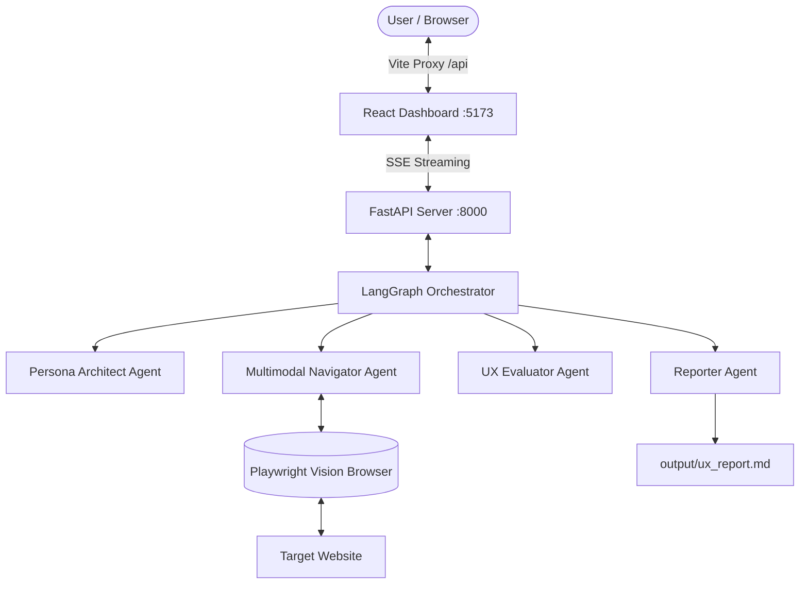

# Zynx — Multimodal UX Intelligence Platform

[](https://www.python.org/)
[](https://fastapi.tiangolo.com/)
[](https://react.dev/)
[](https://vitejs.dev/)
[](https://playwright.dev/)
[](https://crewai.com/)
[](https://langchain.com/)

**Zynx** is an autonomous, multimodal UX intelligence and usability testing platform. It simulates real human user personas navigating web applications, analyzes cognitive load, measures psychological friction, detects design biases, and generates comprehensive UX scorecards and audit reports.

---

## Table of Contents

- [System Architecture](#system-architecture)
- [Modes of Operation](#modes-of-operation)
- [Prerequisites](#prerequisites)
- [Environment Setup](#environment-setup)
- [Option 1: Running the Full-Stack Web Application (Recommended)](#option-1-running-the-full-stack-web-application-recommended)
  - [1. Backend Setup (FastAPI & LangGraph)](#1-backend-setup-fastapi--langgraph)
  - [2. Frontend Setup (React & Vite Dashboard)](#2-frontend-setup-react--vite-dashboard)
- [Option 2: Running the Autonomous CLI Workflow](#option-2-running-the-autonomous-cli-workflow)
- [Option 3: Running the Backend Orchestrator Test](#option-3-running-the-backend-orchestrator-test)
- [Project Directory Structure](#project-directory-structure)
- [UX Metrics & Scoring Explained](#ux-metrics--scoring-explained)
- [Troubleshooting & FAQs](#troubleshooting--faqs)

---

## System Architecture

Zynx operates via multi-agent orchestration and automated browser interactions:



- **Persona Architect**: Builds detailed psychological personas with defined tech literacy, device, domain familiarity, and frustration thresholds.
- **Multimodal Navigator**: Uses Playwright to inspect the DOM, capture visual state, decide on actions (click, scroll, input, navigate), and record System 1 (instinctive) vs. System 2 (calculated) cognitive reasoning.
- **UX Evaluator**: Scores efficiency, effectiveness, learnability, cognitive load, and psychological biases (F-pattern scanning, banner blindness, anchoring).
- **Reporter**: Compiles executive summaries, pain points, scorecards, and writes out `output/ux_report.md`.

---

## Modes of Operation

1. **Interactive Full-Stack Web App**: Live visual dashboard with Server-Sent Events (SSE) streaming, score rings, telemetry graphs, and interactive run logs.
2. **Autonomous CLI Workflow**: Direct terminal runner powered by CrewAI sequential agents.

---

## Prerequisites

Ensure you have the following installed on your machine:

- **Python**: Version `3.10` or higher (`python3 --version`)
- **Node.js**: Version `18.0` or higher (`node -v`)
- **npm**: Version `9.0` or higher (`npm -v`)
- **An LLM Provider API Key** (at least one):
  - **Groq API Key** (Recommended for ultra-fast inference and tool calling): [groq.com](https://console.groq.com)
  - **OpenAI API Key**: [platform.openai.com](https://platform.openai.com)
  - *(Optional)* **Ollama**: For running local offline models like `qwen2.5:7b` (supported in CLI mode)

---

## Environment Setup

Create your `.env` file in the root of the repository:

```bash
cp .env.example .env
```

Open `.env` in your editor and provide your API key(s):

```env
# Required: Provide at least one API key
GROQ_API_KEY=gsk_your_groq_api_key_here
OPENAI_API_KEY=sk-your_openai_api_key_here

# Optional: Groq base URL (leave commented out for default)
# GROQ_API_BASE=
```

---

## Option 1: Running the Full-Stack Web Application (Recommended)

This mode runs the **FastAPI backend** (with LangGraph & Playwright) and the **React + Vite dashboard** with live streaming evaluation results.

### 1. Backend Setup (FastAPI & LangGraph)

Open a new terminal tab:

```bash
# 1. Navigate to the backend directory
cd Unnamed_backend

# 2. Create and activate a Python virtual environment
python3 -m venv venv
source venv/bin/activate       # On Windows: venv\Scripts\activate

# 3. Upgrade pip and install dependencies
pip install --upgrade pip
pip install -r requirements.txt

# 4. Install Playwright browser binaries
playwright install chromium

# 5. Start the FastAPI backend server
uvicorn main:app --host 0.0.0.0 --port 8000 --reload
```

The backend is now live:
- **API URL**: [http://localhost:8000](http://localhost:8000)
- **Interactive Swagger Docs**: [http://localhost:8000/docs](http://localhost:8000/docs)
- **Health Check**: [http://localhost:8000/health](http://localhost:8000/health)

---

### 2. Frontend Setup (React & Vite Dashboard)

Open a second terminal tab:

```bash
# 1. Navigate to the frontend directory
cd Unnamed_frontend

# 2. Install Node dependencies
npm install

# 3. Start the Vite development server
npm run dev
```

The frontend dashboard will be available at:
- **Dashboard URL**: [http://localhost:5173](http://localhost:5173)

### Using the Web Dashboard:
1. Open [http://localhost:5173](http://localhost:5173) in your browser.
2. Enter the **Target Website URL** (e.g., `https://news.ycombinator.com` or `https://example.com`).
3. Select or customize the **Persona** (Novice, Intermediate, Expert, Tech Literacy, Frustration Tolerance).
4. Enter the **Task Description** (e.g., *"Find pricing information and click get started"*).
5. Click **Launch UX Evaluation** and watch live telemetry, thought traces, DOM actions, and score rings update in real time!
6. Once complete, view the full scorecard and exported markdown report.

---

## Option 2: Running the Autonomous CLI Workflow

If you prefer to run tests purely from the command line without opening a browser dashboard, use the CrewAI-powered runner:

```bash
# 1. From the repository root directory
python3 -m venv venv
source venv/bin/activate       # On Windows: venv\Scripts\activate

# 2. Install root dependencies
pip install --upgrade pip
pip install -r requirements.txt

# 3. Install Playwright browser binaries
playwright install chromium

# 4. Run the CLI
python main.py
```

### Interactive Prompt:
```text
==================================================
      ZYNX UX INTELLIGENCE PLATFORM       
==================================================
Enter Website URL (e.g., google.com): https://example.com
Enter Audience Description: Non-technical first-time visitor looking for company information
```

The CrewAI agents will sequentially execute:
1. `Psychological Persona Architect`: Constructs the user profile.
2. `Simulated Human User`: Launches Playwright, performs actions, logs System 1/System 2 decisions.
3. `UX Evaluator & Analyst`: Scores usability factors and detects friction spikes.
4. `Professional UX Report Writer`: Saves the final report to [output/ux_report.md](file:///Users/sejalgupta/Desktop/zynx/output/ux_report.md).

---

## Option 3: Running the Backend Orchestrator Test

To test the LangGraph state machine and Playwright headless runner directly:

```bash
cd Unnamed_backend
source venv/bin/activate
python run_test.py
```

This runs a sample test against `https://example.com` and logs each graph node as it executes.

---

## Project Directory Structure

```text
zynx/
├── .env.example             # Template for API keys (Groq, OpenAI)
├── requirements.txt         # Root CLI dependencies (CrewAI, Playwright, LangGraph)
├── main.py                  # CLI entrypoint for CrewAI UX evaluation
├── agents.py                # CrewAI agent definitions (Persona, Navigator, Evaluator, Reporter)
├── tasks.py                 # CrewAI task definitions & prompt engineering
├── output/
│   └── ux_report.md         # Generated markdown UX audit report
├── tools/
│   └── browser_tool.py      # Playwright browser automation tool for CrewAI
│
├── Unnamed_backend/         # FastAPI + LangGraph Orchestration Service
│   ├── main.py              # FastAPI server entrypoint (SSE stream endpoint /api/evaluate)
│   ├── requirements.txt     # Backend dependencies (FastAPI, LangGraph, Playwright, Uvicorn)
│   ├── run_test.py          # Standalone test script for LangGraph graph execution
│   ├── agents/              # Multimodal, evaluator, and reporter agents
│   │   ├── multimodal_agent.py
│   │   ├── evaluator_agent.py
│   │   └── reporter_agent.py
│   ├── orchestrator/        # LangGraph state machine & runner
│   │   ├── graph.py         # StateGraph nodes and edges
│   │   ├── runner.py        # Async event streamer
│   │   └── state.py         # UXEvaluationState schema
│   └── tools/
│       └── vision_browser.py # Playwright async browser with DOM extraction & screenshots
│
└── Unnamed_frontend/        # Modern React + Vite Dashboard
    ├── package.json         # Frontend dependencies (React 18, Lucide icons, Vite)
    ├── vite.config.js       # Vite config with backend proxy (/api -> localhost:8000)
    ├── index.html           # HTML entrypoint
    └── src/
        ├── App.jsx          # Main evaluation dashboard, score rings, live log stream
        ├── main.jsx         # React DOM root
        └── index.css        # Premium styling & dark mode design tokens
```

---

## UX Metrics & Scoring Explained

Zynx measures usability across quantitative metrics and psychological dimensions:

| Dimension | Scale | Description |
|---|---|---|
| **Effectiveness** | 0 – 10 | Task completion rate and achievement of the target user goal. |
| **Efficiency** | 0 – 10 | Action count, navigation path length, and absence of circular browsing. |
| **Learnability** | 0 – 10 | How quickly the simulated persona understands navigation hierarchy and layout. |
| **Cognitive Load** | 0 – 10 | Mental friction experienced due to dense DOM elements or ambiguous copy. |
| **Frustration Index** | 0 – 10 | Escalation score caused by broken links, unexpected shifts, or dead ends. |
| **System 1 / System 2** | Ratio % | Balance between intuitive, rapid decisions (System 1) vs deliberate scrutiny (System 2). |
| **Psychological Biases** | 0 – 10 | Indicators for F-Pattern scanning, Banner Blindness, Anchoring, and Confirmation bias. |

---

## Troubleshooting & FAQs

### 1. `Executable doesn't exist at .../ms-playwright/chromium...`
Playwright browser binaries are not installed yet in your virtual environment.
Run:
```bash
playwright install chromium
```

### 2. Frontend shows `Failed to fetch` or cannot connect to backend
- Ensure the FastAPI server is running on `http://localhost:8000`.
- Verify the Vite proxy is active (requests to `http://localhost:5173/api/...` are routed to port `8000`).
- Check if your backend crashed due to a missing API key.

### 3. Missing API key warning
- Make sure you copied `.env.example` to `.env` in the root repository folder.
- Ensure `GROQ_API_KEY` or `OPENAI_API_KEY` contains a valid key.
- Verify there are no trailing spaces or quotes around the key in `.env`.

### 4. Port conflicts (8000 or 5173 already in use)
- To run the backend on a different port:
  ```bash
  uvicorn main:app --host 0.0.0.0 --port 8001 --reload
  ```
  *(Remember to update `target: 'http://localhost:8001'` in `Unnamed_frontend/vite.config.js`)*.
- To run the frontend on a different port:
  ```bash
  npm run dev -- --port 3000
  ```

### 5. Running with local Ollama
If running CLI mode with Ollama:
```bash
ollama serve
ollama pull qwen2.5:7b
```
Ensure Ollama is accessible at `http://localhost:11434`.
